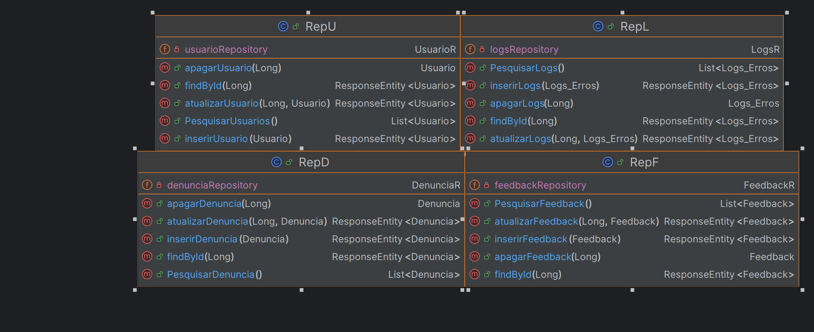
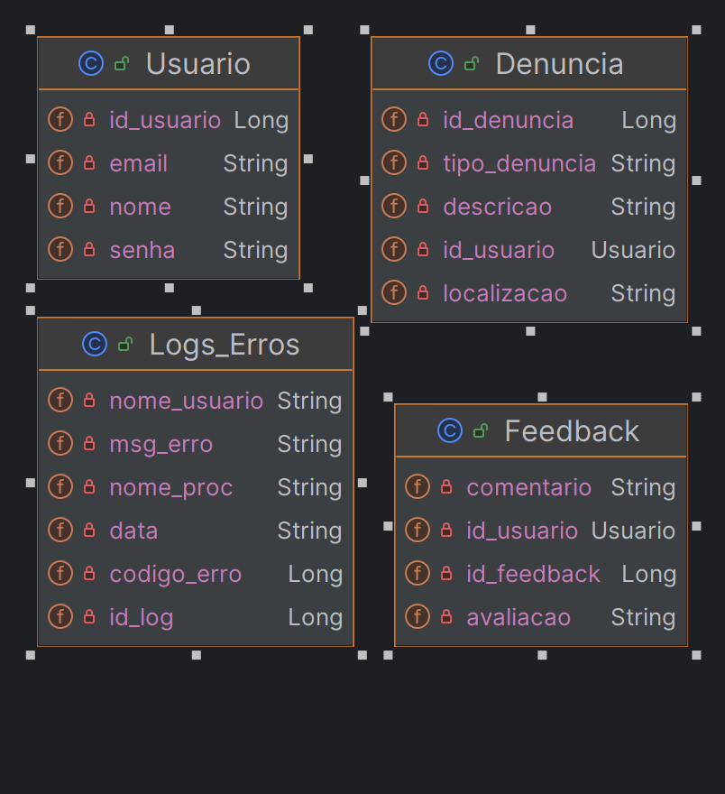

<div align="center">
    <h2>Wink</h2>
</div>

--------------------------------------------------
## 📚 Projeto 
<h4>Introdução</h4> 

<p>A saúde dos oceanos é vital para a sustentabilidade do planeta. Este projeto visa desenvolver uma página web dedicada à conscientização sobre a saúde marinha, fornecendo informações, dicas práticas e um canal para denúncias de atividades prejudiciais aos oceanos. A proposta está alinhada com os princípios da Economia Azul, que busca garantir atividades humanas nos oceanos que sejam ecologicamente responsáveis, socialmente inclusivas e economicamente viáveis a longo prazo.</p>

<h4>Objetivos</h4> 

- Educar o público sobre a importância dos oceanos para a vida no planeta.
- Oferecer orientações sobre como adotar práticas sustentáveis que minimizem o impacto negativo nos oceanos.
- Disponibilizar um canal de denúncias para relatar atividades prejudiciais ao ambiente marinho.
<p></p>

--------------------------------------------------

<h3>Integrantes</h3>

- Thiago Ulrych - RM97951
- Bruno Ramos da Costa - RM551942
- Guilherme Faria de Aguiar - RM551374
- Henrique Roncon Pereira - RM99161
- Lucas Carabolad Bob - RM550519
--------------------------------------------------

<h3>Como Rodar a Aplicação </h3>

<h4>Pré-requisitos</h4> 

- [Java Development Kit (JDK)](https://www.mysql.com/downloads/) instalado em seu sistema.
- [Eclipse IDE](https://www.eclipse.org/downloads/) instalado em seu sistema.

<h4>Passos para Executar a Aplicação</h4> 

- Clonar o Repositório:
```bash
git clone https://github.com/1tico1/Wink.git
```
<h3>Rodar este link para acessar Pagina principal do Swagger</h3>

- http://localhost:8080/swagger-ui/index.html?configUrl=/v3/api-docs/swagger-config

<h4>Tabela de EndPoints(Localhost:8080/index_)</h4> 

Localhost:8080/index_usuario
  - FindAll (/todos)
  - FindById ("/{id_usuario}")
  - Put ("/inserir_usuario/{id_usuario}")
  - Post ("/atualiza_usuario{id_usuario")
  - Delete ("/remove_usuario/{id_usuario}")

  Localhost:8080/index_feedback
  - FindAll (/todos)
  - FindById ("/{id_feedback}")
  - Put ("/inserir_feedback/{id_feedback}")
  - Post ("/atualiza_feedback/{id_feedback")
  - Delete ("/remove_feedback/{id_feedback}")


  Localhost:8080/index_denuncia
  - FindAll (/todos)
  - FindById ("/{pedido_id}")
  - Put ("/inserir_denuncia/{id_denuncia}")
  - Post ("/atualiza_denuncia/{id_denuncia")
  - Delete ("/remove_denuncia/{id_denuncia}")


  Localhost:8080/index_logs
  - FindAll (/todos)
  - FindById ("/{id_log}")
  - Put ("/inserir_logs/{id_log}")
  - Post ("/atualiza_logs/{id_log")
  - Delete ("/remove_logs/{id_log}")

--------------------------------------------------

## 📈 Diagrama

<div>
    
</div>
<div>
    
</div>


<br/>
# Wink
Spring Boot aplication for Global Solution (Ocean Tecnology)
